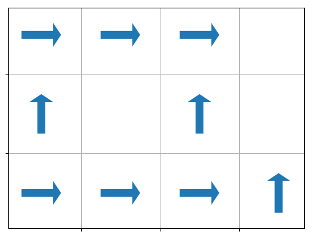

# Gridworld - Reinforcement learning


## Problem description

The grid world problem is a good way to illustrate the fundamental aspects of reinforcement learning. The problem is to find a policy (i.e a mapping for each possible state give to an action) that maximize the payoff.  For the gridworld problem, we have two cost.The first one is associate with two specific state which are the destination and a cost by step. we are thus an agent moving in a grid trying to find to grid we the treasure (payoff of 1 unit) without falling into a hole (payoff of -1) with a cost per step that be associate with fuel in the real world.


Since we have only the payoff for terminal states, the first step is to evaluate the payoff for other states. Those local payoff will depend of the policy chosen. We thus have a loop we evaluate the payoff to find a good strategy and use that strategy to evaluate new payoffs which will give a new strategy etc.


## Algorithm

The basic steps are:

1. Initialisation 
2. Value function evaluation
3. Policy Improvement


One can evaluate a policy by iteration with the pseudo code

-------------------

{style="padding:16px"}

-----------------------

or by using the Monte Carlo method

---------------------------


-----------------------


The algorithm will then be in alternating parts. The first part we be to evaluate the 

Those evaluation are based on Markov Decision Processes. 

Principal reference: Reinforcement Learning: An Introduction by Andrew Barto and Richard S. Sutton

We have that chapter 3 (p.66, 69 and 70)


$$
P_{ss^\prime}^a = P(s_{t+1} = s^{\prime}|s_{t} = s, a_t = a)
$$

$$
R_{ss^\prime}^a = E(r_{t+1}|s_{t} = s, a_t = a, s_{t+1} = s^\prime)
$$

$$
V^\pi(s) = E_\pi[R_t|s_t = s] = E_\pi [\sum_{k=0}^\infty \gamma^k r_{t + k + 1}| s_t = s ]
$$

$V^\pi$ : state-value function for policy $\pi$ 

$ Q^\pi(s,a) $: action-value function for policy $\pi$
$$
Q^\pi(s,a) = E_\pi [\sum_{k=0}^\infty \gamma^k r_{t + k + 1}| s_t = s, a_t = a]
$$
Bellman equation:
$$
V^\pi(s) = \sum_{a}\pi(s,a)\sum_{s^\prime}P_{ss^\prime}^a[R_{ss^\prime}^a + \gamma V^\pi(s^\prime)]
$$
Pseudo-code:

Initialize $Q(s,a), \pi(s), Return(s,a)​$

```

```

Repeat

 * Generate an episode using exploring start and $pi$

 * For each $(s,a)$ pair  in episode

    * R <-- return following the first occurance of s,a
    * append R to Returns(s,a)
    * Q(s,a) <-- Average(Returns(s,a))

* For each s

  * $\pi(s)$ <-- $\arg max_a Q(s,a)​$

    


## A short example


### Initial policy

The initial policy for the example is:




We will evaluate the value function by value iteration or Monte Carlo t o to obtain the expected payoff at each state:


### Improving the policy

We can improve the policy by a greedy approach from the expected payoff for each states to obtain:


and evaluate the new policy values (using Monte Carlo or Value Iteration)  to obtain


## Unittest

To run the tests:

```bash
python grid_test.py
```


